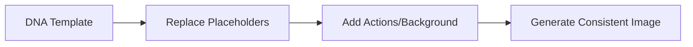

# SillyTavern DNA System

A method for creating **visually consistent characters** in SillyTavern using **prompt engineering alone**—no LoRA, IP-Adapter, or additional models required.

Perfect for users who want to generate consistent character images in SillyTavern with ComfyUI, Stable Diffusion, or other backends, without relying on extra training or model files.

## 🧠 The Idea

The DNA System lets you define a character's core visual "DNA" using placeholders (e.g., `{hair}`, `{eyes}`, `{outfit}`). This template can then be reused and adapted across different scenes, outfits, and styles—all through prompt engineering.



## 🚀 How to Set Up

### 1. Enable Quick Reply
- In SillyTavern, enable **Quick Reply** from the settings.

### 2. Import the DNA System
- Import the provided `dna-system.json` file into your Quick Reply presets.

### 3. Create Your First Character DNA
- Click **DNA-Book** → **Create**.
- Enter your character's name and write your DNA prompt using placeholders (e.g., `{hair} hair, {eyes} eyes, wearing {outfit}`).
- You can edit this DNA anytime from the DNA-Book.

### 4. Configure Image Generation
- Go to your image generation extension settings (e.g., Stable Diffusion) → **Styles**.
- In the **Positive Prompt** field, enter:
  ```
  {{getglobalvar::masterprompt}}
  ```
  Or if using a style:
  - Positive: `{{getglobalvar::master-style-pos}}`
  - Negative: `{{getglobalvar::master-style-neg}}`

### 5. Create Styles
- In **Style-Book**, create a new style.
- Use this format:
  ```
  [Positive prompt here] Negative: [Negative prompt here]
  ```
- You can use `{master}` in your style prompt—it will auto-replace with the final character DNA.

### 6. Customize Appearance: Two Methods

#### **Method 1: Direct DNA Editing**
- Go to **DNA-Book** → **Edit** → Select your character
- Click the **Hairstyle** or **Outfit** button to input by yourself.

#### **Method 2: Wardrobe & Barber System**
- **For outfits**: 
  - `Wardrobe → Create` to design new outfits
  - `Wardrobe → Select → [Choose Outfit]` to apply them
- **For hairstyles**:
  - `Barber → Create` to design new hairstyles  
  - `Barber → Select → [Choose Hairstyle]` to apply them

### 7. Share Your Books
- You can export/import both DNA-Book and Style-Book to share with others.

### 8. Bind DNA to a Character Card
- In your character card, at the end of the description, add:
  ```
  {{getglobalvar::name::[Your Character's Name]}}
  ```
  Make sure a DNA entry with the **same name** exists in your DNA-Book.

---

## 📌 DNA Prompt Formula & Examples

### **DNA Prompt Formula:**
```
Professional photography of a [AGE] year old [GENDER] [OCCUPATION/ROLE], (named [CHARACTER_NAME]:1.2-1.35), {clothing}, [FACIAL_STRUCTURE_DETAILS], hair {hairstyle}, (EYE_DESCRIPTION:1.3), [LIPS_AND_MAKEUP], [BODY_TYPE_AND_SKIN], {accessories}.
```

**Key Elements:**
- **Name Emphasis**: Always use `(named [NAME]:1.2)` or higher (1.2-1.35) for character consistency
- **Placeholders**: Use `{clothing}`, `{hairstyle}`, `{accessories}` for dynamic changes
- **Feature Emphasis**: Important features (eyes, specific traits) should have weight values (1.1-1.3)

### **Example 1: Female Character**
```
Professional photography of a 28 year old female CEO, (named Eleanor Sterling:1.25), {clothing}, with a heart-shaped face, high cheekbones, sharp jawline, subtle brow ridge, hair {hairstyle}, (almond-shaped bright blue eyes with thick lashes:1.3), full lips with nude matte lipstick and defined cupid's bow, slender athletic figure with smooth pale skin, {accessories}, professional lighting, sharp focus, studio background.
```

### **Example 2: Male Character**
```
Professional photography of a 32 year old male detective, (named Marcus Blackwood:1.25), {clothing}, with a square jawline, defined cheekbones, prominent brow ridge, subtle forehead wrinkles, hair {hairstyle}, (intense gray eyes with dark circles:1.3), thin lips with neutral expression and slight stubble, lean muscular build with fair skin, (broad shoulders, defined arms:1.15), {accessories}, dramatic lighting, noir atmosphere, rainy city background.
```

### **Example 3: Fantasy Character**
```
Epic fantasy portrait of a 150 year old elven mage, (named Lyra Moonwhisper:1.3), {clothing}, with an elongated elegant face, high delicate cheekbones, pointed ears, hair {hairstyle}, (large mystical silver eyes with starry pupils:1.35), thin lips with iridescent blue lipstick, slender ethereal figure with luminous pale skin, glowing magical aura, (small subtle breasts:1.15), {accessories}, magical particles, enchanted forest background.
```

---

## 🎨 Quick Customization Workflow

1. **For a new outfit**:
   - Option A: Edit DNA directly → Click "clothing" button
   - Option B: Wardrobe → Create → Save → Wardrobe → Select

2. **For a new hairstyle**:
   - Option A: Edit DNA directly → Click "hairstyle" button  
   - Option B: Barber → Create → Save → Barber → Select

3. **Style combinations** can be saved and swapped instantly during chats.

---

## ❓ FAQ

**Q: Do I need LoRA or trained models?**  
A: No—this works entirely through prompt engineering and placeholder substitution.

**Q: Why is the name emphasis so important?**  
A: Using `(named [NAME]:1.2-1.35)` forces the AI to recognize and maintain character identity across generations. Never use less than 1.2.

**Q: Can I use this with any image generation backend?**  
A: Yes, as long as SillyTavern is configured to use it.

**Q: How do I change outfits or hairstyles dynamically?**  
A: Two ways: 1) Directly in DNA-Book edit mode, or 2) Using the Wardrobe/Barber system to create and select variations.

**Q: Can I share my character designs?**  
A: Yes! Export your DNA-Book and Style-Book to share with others.

---

## 📄 License

This project is licensed under the **MIT License**. See the LICENSE file for details.

## 🙏 Thanks To

This project builds upon the innovative work of others in the AI community. Special thanks to:

- **Zanno** for pioneering the concept and providing foundational inspiration
- **Creepybits** for developing [World_weaver](https://github.com/Creepybits/World_weaver) and popularizing the "AI film crew" methodology
- The comprehensive article by Creepybits: [Creating Consistent AI Characters Without LoRAs or Reactor](https://zanno.se/creating-consistent-ai-characters-without-loras-or-reactor/) which provided the theoretical foundation for this approach

This implementation represents a practical adaptation of their ideas specifically for SillyTavern users seeking character consistency through prompt engineering alone.
